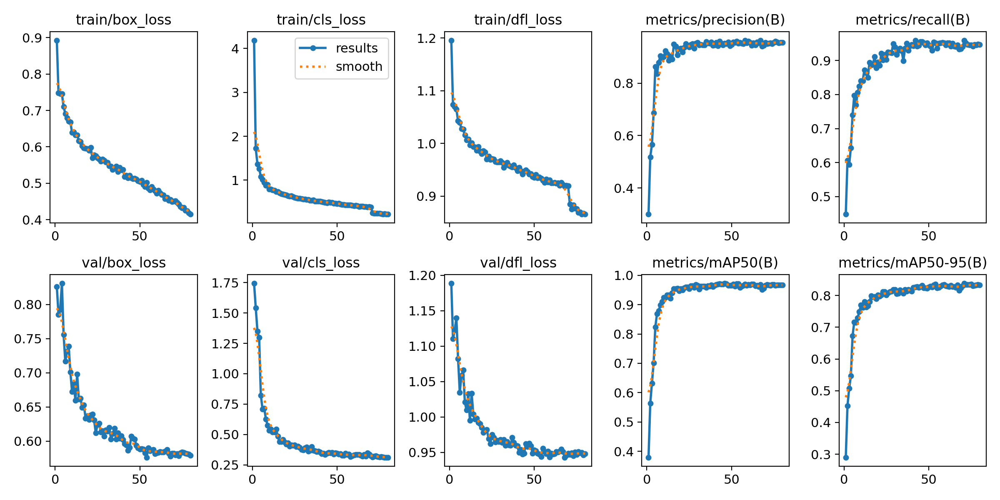
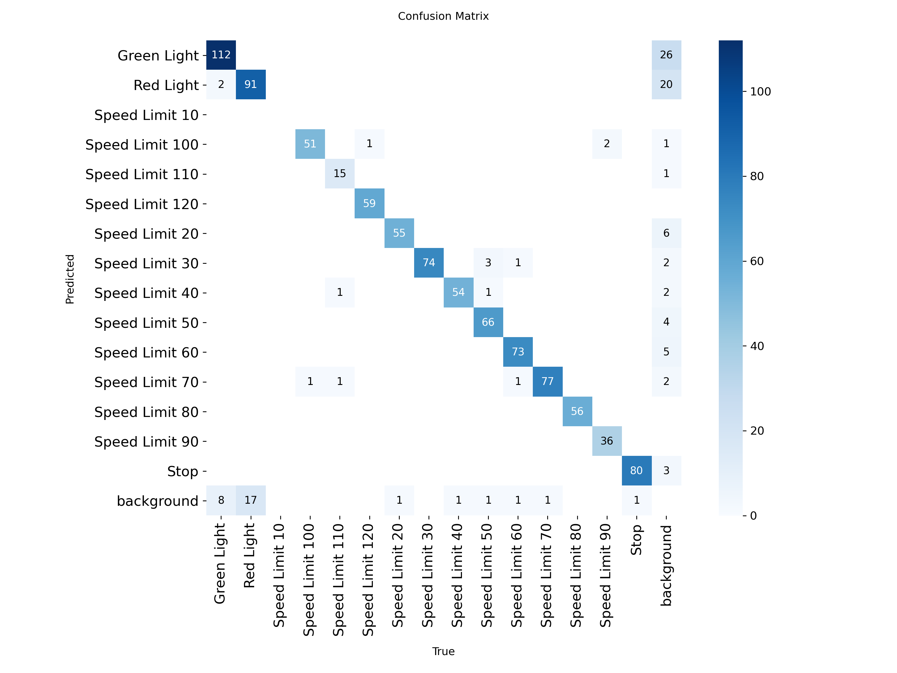
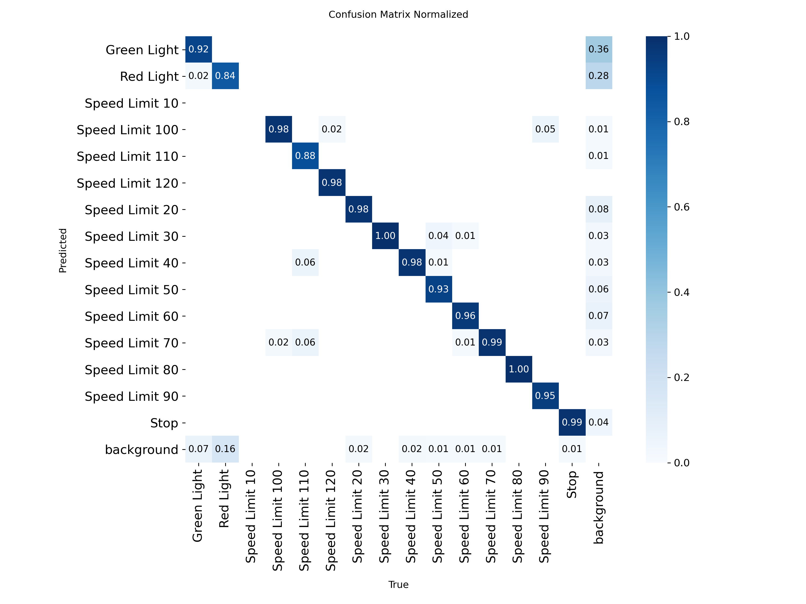
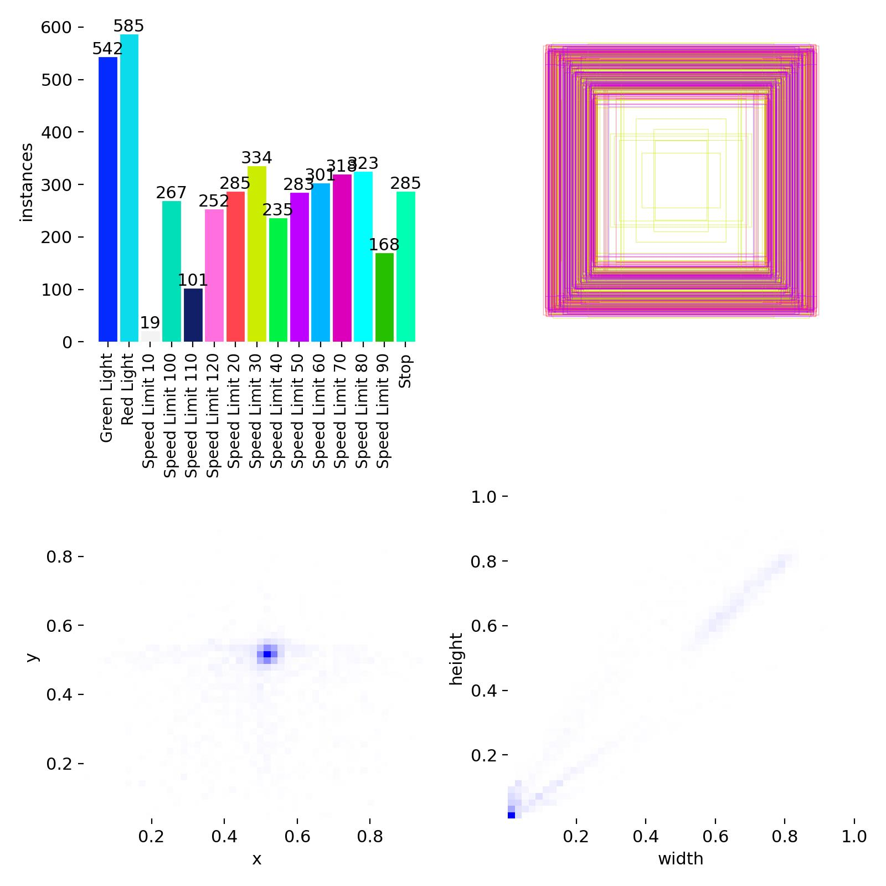
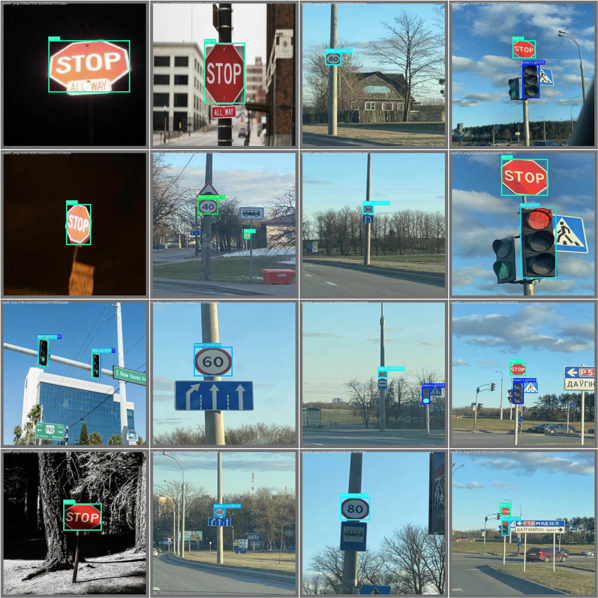
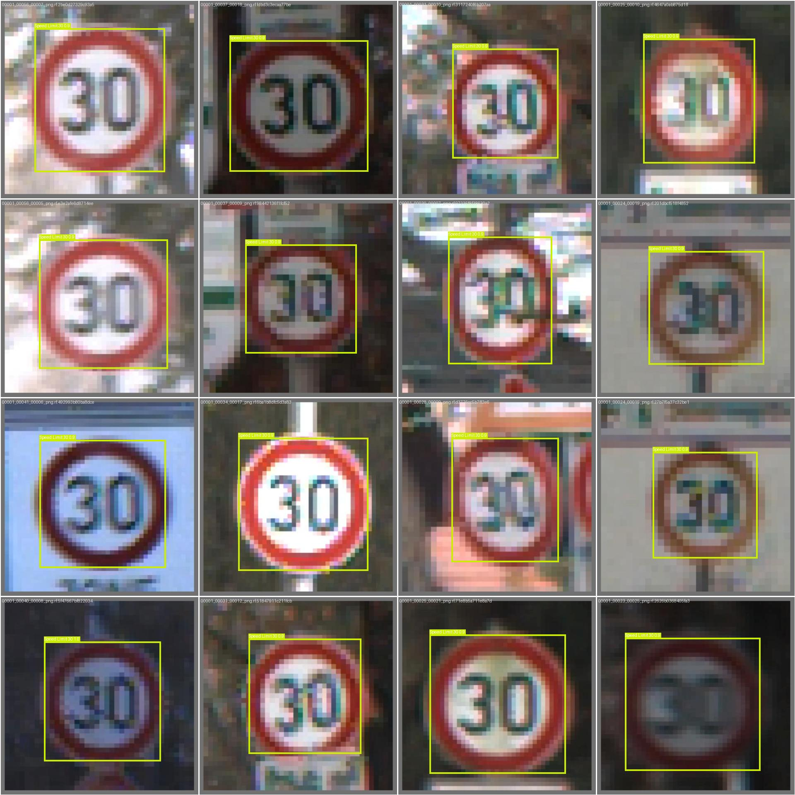

# 交通信号识别实验报告

**姓名：** 张晓敏  
**学号：** 112304260116

## 1. 实验目标

使用 YOLO 目标检测模型完成交通信号与交通标志识别任务，并结合训练曲线、混淆矩阵和预测结果对模型表现进行分析。

## 2. 实验环境

- 操作系统：Linux（Ubuntu / Debian）
- Python 版本：3.11.14
- PyTorch 版本：2.5.1+cu121
- YOLO 版本：Ultralytics YOLOv8 8.4.49
- GPU：NVIDIA GeForce RTX 3090
- CPU：AMD EPYC 7702 64-Core Processor
- CUDA 版本：12.8

## 3. 模型与训练设置

### 3.1 模型选择

本实验选择 `YOLOv8s` 作为检测模型。它在检测精度和推理速度之间取得了较好的平衡，适合在当前硬件环境下完成训练与实验分析。

### 3.2 训练参数

- 训练轮数：80
- 输入尺寸：640
- Batch Size：32
- 优化器：AdamW
- 学习率：0.01
- 早停参数：20
- 实验名称：`round1_yolov8s_640`

### 3.3 训练命令

```bash
yolo detect train \
  data=data.yaml \
  model=yolov8s.pt \
  epochs=80 \
  imgsz=640 \
  batch=32 \
  device=0 \
  workers=8 \
  patience=20 \
  name=round1_yolov8s_640
```

## 4. 训练过程分析

### 4.1 损失与指标曲线



分析结论：

1. 训练初期各项损失下降较快，说明模型能够较快学习到目标特征。
2. 中后期曲线逐渐平稳，说明模型基本收敛。
3. 验证集指标整体保持较高水平，没有出现明显震荡。
4. 从结果来看，`mAP50` 最终达到较高水平，模型总体训练效果较好。

## 5. 混淆矩阵分析

### 5.1 原始混淆矩阵



### 5.2 归一化混淆矩阵



分析结论：

1. 大部分速度限制类标志识别效果较好，分类边界较清晰。
2. `Green Light` 与 `Red Light` 之间仍存在一定混淆。
3. 部分相似数字的限速标志在小目标情况下更容易出现误判。
4. 归一化矩阵说明模型整体稳定，但在少数细粒度类别上仍有提升空间。

## 6. 样本与预测效果展示

### 6.1 标签分布示意



### 6.2 预测结果示例




分析结论：

1. 大尺寸、清晰目标的检测结果较稳定。
2. `Stop` 和部分限速标志检测效果较好。
3. 远距离、小尺寸目标更容易出现漏检。
4. 红绿灯类别在复杂背景和较弱光照下仍有改进空间。

## 7. 实验结果

- 本地验证结果：`mAP50 = 0.968`
- 本地验证结果：`mAP50-95 = 0.839`
- 比赛网站提交分数：`0.9336`
- 报告记录当前排名：`2`

### 7.1 各类别验证结果

| 类别 | Precision | Recall | mAP50 | mAP50-95 |
|------|-----------|--------|-------|----------|
| Green Light | 0.864 | 0.882 | 0.895 | 0.545 |
| Red Light | 0.855 | 0.819 | 0.798 | 0.486 |
| Speed Limit 100 | 0.942 | 0.981 | 0.990 | 0.885 |
| Speed Limit 110 | 1.000 | 0.969 | 0.995 | 0.927 |
| Speed Limit 120 | 0.989 | 0.983 | 0.994 | 0.923 |
| Speed Limit 20 | 0.975 | 0.982 | 0.990 | 0.879 |
| Speed Limit 30 | 0.924 | 1.000 | 0.979 | 0.912 |
| Speed Limit 40 | 0.929 | 0.982 | 0.993 | 0.890 |
| Speed Limit 50 | 0.971 | 0.937 | 0.986 | 0.880 |
| Speed Limit 60 | 0.978 | 0.974 | 0.982 | 0.901 |
| Speed Limit 70 | 0.943 | 0.987 | 0.994 | 0.902 |
| Speed Limit 80 | 0.992 | 1.000 | 0.995 | 0.879 |
| Speed Limit 90 | 1.000 | 0.954 | 0.975 | 0.807 |
| Stop | 0.960 | 0.988 | 0.985 | 0.926 |
| **平均** | **0.952** | **0.960** | **0.968** | **0.839** |

### 7.2 结果分析

1. 本地验证结果高于线上提交分数，说明验证集与测试集分布存在一定差异。
2. `Green Light` 和 `Red Light` 是当前模型的相对薄弱类别。
3. 限速类标志整体表现较强，是模型当前的主要优势。

## 8. 实验总结

本次实验中，`YOLOv8s` 在交通信号识别任务上取得了较好的整体效果，`mAP50` 达到 `0.968`，说明模型已经具备较强的检测能力。对于大多数速度限制标志和 `Stop` 标志，模型表现稳定。

当前最明显的问题集中在红绿灯类别区分以及小目标检测。后续可以从增加相关样本、优化数据增强策略、尝试更大模型以及继续调整训练参数等方向继续改进。
